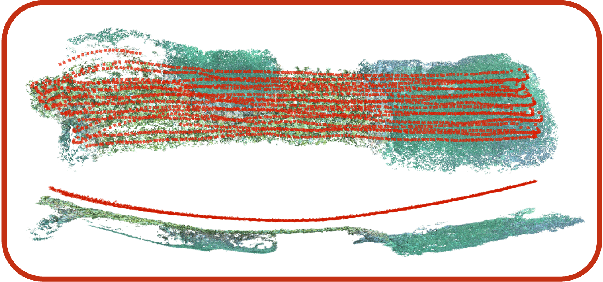
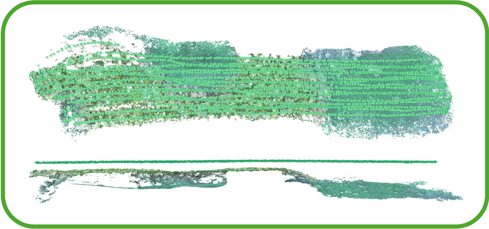
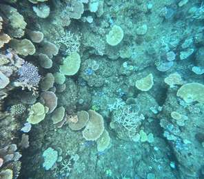
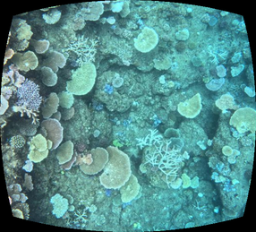
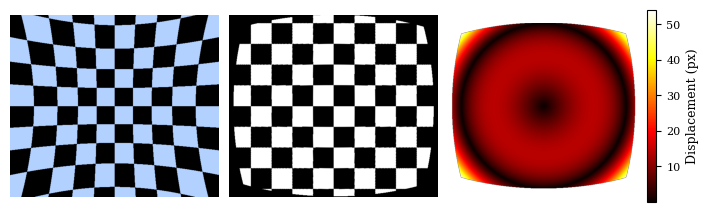

# Refrax

Refraction removal for underwater cameras behind a flat port.

Given the in-air intrinsics of a camera and the geometry of its flat-port
housing, Refrax traces every pixel through the air–glass–water interfaces and
warps the underwater image into a refraction-free pinhole image, so that it
can be used directly by standard tools such as COLMAP.

<p align="center">
  <a href="https://huggingface.co/spaces/cllim118/refrax-demo">
    
  </a>
</p>

<p align="center">
  
  
</p>
<p align="center">
  <em>
    COLMAP reconstruction of Lizard Island coral reef, top and side views.<br>
    Left: raw images, the camera trajectory (red) bends.<br>
    Right: Refrax-corrected images, the trajectory (green) stays flat.
  </em>
</p>

> **Paper:** *Image-Space Refraction Correction for Underwater 3D Reconstruction: Warping Flat-Port Views into Pinhole Perspective*  
> Under review · arXiv coming soon

## Installation

The environment is managed with [pixi](https://pixi.sh):

```bash
pixi install
```

## Usage

All scripts read a YAML config; see [`configs/lizardisland.yaml`](configs/lizardisland.yaml).

### Remove refraction

```bash
pixi run remove-refraction configs/lizardisland.yaml
```

<p align="center">
  
  &emsp;&emsp;
  
</p>

<p align="center">
  <em>Left: raw underwater image. Right: corrected by Refrax.</em>
</p>

For every image in `paths.rgb_dir` this writes:

| Output | Content |
| --- | --- |
| `<output_dir>/<name>.png` | corrected image, cropped to the largest rectangle without invalid pixels (`crop_valid_bbox: true`), or BGRA with the validity mask as alpha |
| `<mask_dir>/mask.png` | validity mask (per image in depth-map mode) |
| `<output_dir>/../new_calibration.yaml` | pinhole intrinsics of the corrected images (fixed-depth mode) |

Existing outputs are skipped; pass `--overwrite` to recompute them.

**Method.** The pixel grid is traced forward through the housing onto the scene
plane, and the resulting map is inverted by interpolation.

**Depth.** Flat-port refraction is depth-dependent. With `paths.depth_dir: null`
the scene is assumed to lie at depth `correction.z0_fixed` and a single map is
used for all images. Otherwise a depth map `<depth_dir>/<name>.npy` (same unit
as the housing parameters) is loaded per image and each image gets its own map
and crop. No calibration file is written in this mode, because the crop, and so
the principal point, differs from image to image.

**Zoom.** A flat port magnifies the scene, so the corrected image uses focal
length `zoom · (fx, fy)`. With `correction.zoom: null` the zoom is chosen
automatically: the value in [1.3, 1.55] that best approximates the refracted
projection at `z0_fixed` by a pinhole, while keeping the whole underwater image
inside the frame. The chosen value is written to the calibration file.

**Lens distortion.** If any of `k1, k2, p1, p2` is non-zero, the raw images are
assumed to be distorted and the distortion is removed in the same warp.

### Visualise the correction

```bash
pixi run visualise-refraction configs/lizardisland.yaml
```

Simulates a checkerboard at depth `z0_fixed` seen through the housing, corrects
it, and plots the per-pixel displacement.

<p align="center">
  
</p>
<p align="center">
  <em>Left to right: checkerboard underwater, corrected image, and per-pixel displacement.</em>
</p>

### Planarity evaluation

`evaluation/planarity.py` evaluates one or more COLMAP reconstructions
(`points3D.txt`, text format) of a planar scene. With several, they are brought
to the same scale, voxel size and number of points; the first one is the
reference:

```bash
pixi run planarity A/points3D.txt [B/points3D.txt ...] [--names A B ...]
```

Without paths, it evaluates the clouds listed in `INPUTS` at the top of
`evaluation/planarity.py` (label → `points3D.txt`). Missing files are skipped.
Binary COLMAP models must first be converted to text with
`colmap model_converter --output_type TXT`.

Reported metrics: plane-fit RMSE, median and 1–99th percentile peak-to-valley
residuals relative to the in-plane diagonal D of the cloud, the angular
deviation of points seen from the plane centre, and the curvature of a
rotationally symmetric quadric fitted to the residuals. Add `--no-plot` to
print the metrics only.

## Repository layout

```text
.
├── remove_refraction.py       # Main refraction-removal script
├── visualise_refraction.py    # Synthetic checkerboard visualisation
├── configs/                   # Example configurations
└── core/
    ├── optics.py              # Ray tracing through the flat port
    ├── undistort.py           # Refraction correction map
    └── scale.py               # Automatic output scaling
